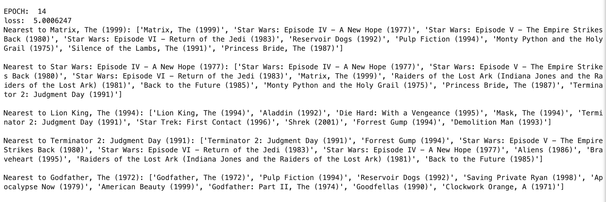

# Graph-Embeddings

### Contents 
This repository sets up a template to embed graph nodes to vectors leveraging embedding methodology from natural language processing. 

### Methodology
Borrowing just the movies data example from https://keras.io/examples/graph/node2vec_movielens/ this Graph-Embedding repository implements the embedding in a different way. First, I use noise contrastive loss (https://arxiv.org/pdf/1806.03664.pdf) and formulate the data through the lens of word embedding setup (https://arxiv.org/pdf/1301.3781.pdf). The difference here is instead of an adjacency based sampling every node to node interaction is compiled. The expectation is that the co-occurence from the data is enough to adjust the weights without any edge weighting. This is plain vanilla implementation with appropriate logging. 

### Setting up the environment
The package management is done by poetry. 
```
conda create -n g2v
conda activate g2v
conda install pip
pip install poetry
poetry install
# pip install tensorflow # This might be needed depending on your system.
python run.py
```

### Output and viewing the results
The final model results can be seen here from the terminal but a better view can be seen from ```run.ipynb```. The results, in my opinion, appear to be more realistic based on the type of movies itself after a 15 epoch training.



### Contact 
If you would like to collaborate or need any help with the code you can reach me at satesh.ramdhani@gmail.com. 